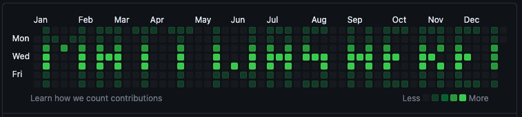

# Hello world, I'm Matt! 👋
**What I'm up to:**
- Coding a startup: [confesi.com](https://confesi.com) 🚀
- Running a [learn-to-code Discord](https://discord.gg/cWHnQFSfMy).
- Working through my honours computer science degree @ [UVic](https://www.uvic.ca/).
- Growing my online software presence: [audience 1](https://www.instagram.com/comicalcoder/), [audience 2](https://www.instagram.com/nerds_coding/).
- Contributing to [#opensource](https://pub.dev/publishers/matthewtrent.me/packages).
- Always looking to [collaborate](mailto:me@matthewtrent.me?subject=Howdy)!

**You may find my [stackoverflow_badge](https://github.com/mattrltrent/stackoverflow_badge) interesting if you like orange rectangles (over 100 daily users):**

 

**... or my [github_painter](https://github.com/mattrltrent/github_painter) if you're a green square kinda person (in use on my 2018 year):**

 

**Recent hackathons:**

| Event        | Repo(s)           | Result  |
| :-------------: |:-------------:| :-----:|
| [Island Health CODEHACK](https://www.islandhealth.ca)     | [Mobile app](https://github.com/mattrltrent/code_hack_2023_client), [Web app](https://github.com/julhoang/code_hack_patient_app), [Server](https://github.com/mattrltrent/code_hack_2023_server) | My teammate and I got recognized for hacking the hackathon before it started, getting awarded symbolic white toques pre-event 👻 |
| [UVic Engineering Competition](https://onlineacademiccommunity.uvic.ca/ess/university-of-victoria-engineering-competition/)      | [Client](https://github.com/mattrltrent/eng_comp_client), [Server](https://github.com/mattrltrent/eng_comp_server)      |   1st place after digesting enough caffeine to decimate an elephant 🥇 |

*Note: I made the LeetCode bot private. If you want to use/buy it, let's talk on Discord.*

Updated December 4, 2023
